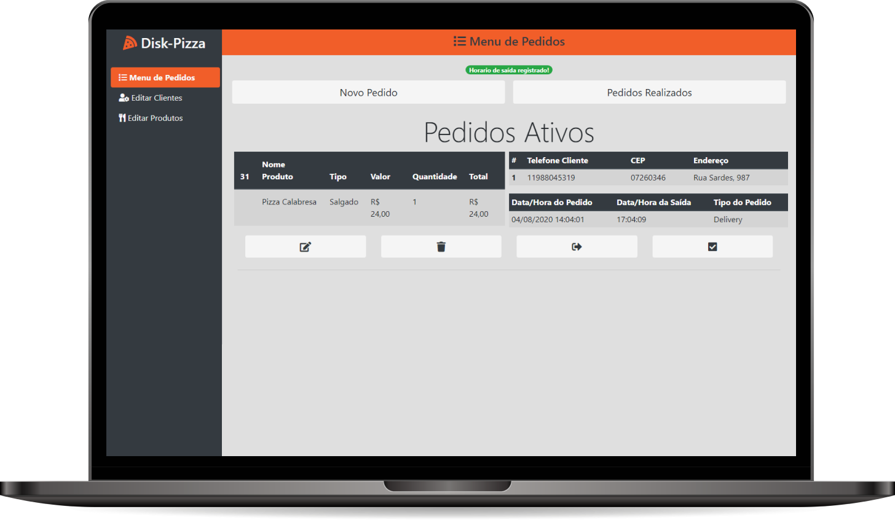

<h1 align="center">
  
</h1>

  <a href="#-tecnologias">Tecnologias</a>&nbsp;&nbsp;&nbsp;|&nbsp;&nbsp;&nbsp;
  <a href="#-projeto">Projeto</a>&nbsp;&nbsp;&nbsp;|&nbsp;&nbsp;&nbsp;
  <a href="#-Modelo de Negócio">Projeto</a>&nbsp;&nbsp;&nbsp;|&nbsp;&nbsp;&nbsp;
  <a href="#-DER">Projeto</a>&nbsp;&nbsp;&nbsp;|&nbsp;&nbsp;&nbsp;
  <a href="#-layout">Layout</a>&nbsp;&nbsp;&nbsp;|&nbsp;&nbsp;&nbsp;
  <a href="#memo-licença">Licença</a>

 

  

 

  

## 🚀 Tecnologias

Esse projeto foi desenvolvido com as seguintes tecnologias:

- PHP
- MySQL
- HTML
- CSS
- Bootstrap
- JavaScript

## 💻 Projeto

O Disk-Pizza é uma aplicação de controle de pedidos, onde é possível cadastrar e excluir pedidos e definir para qual cliente irá a pizza 🍕.

## 🔖 Modelo de Negócio

Você pode visualizar o modelo de negócio através [desse link](.github/modelo-de-negocio.pdf).

## 📚 DER

Você pode visualizar o DER através [desse link](.github/Disk-Pizza-Modelo-Logico.png "DER Disk-Pizza").

## :memo: Licença

Esse projeto está sob a licença MIT. Veja o arquivo [LICENSE](LICENSE.md) para mais detalhes.

---

Feito por [Cleyson Silva](https://www.linkedin.com/in/cleyson-silva-639b01188/) :wave:
